# Chess-Game
Demonstrating Object Oriented Programming. A personal project of mine, to validate my python skills. 

## Functionality

The code is separated into objects, one for each type of piece, one for a piece archetype, one for the board and one for the game.

The board is displayed for each player (white and black) oriented towards their view. Each player must first select the piece to move, then from the options availble to their piece and the rest of the board's constraints, selects their final destination. The options available are displayed to simplify the choices for the player. Then the board is updated and presented upsidedown, ready for the other player.

## Run Through

A simple game is shown below, showing the contingencies in place if a player were to have chosen the wrong piece and the end of the game.

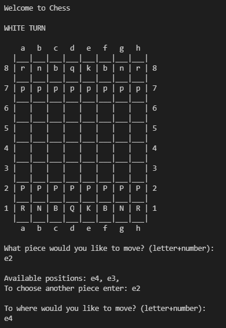

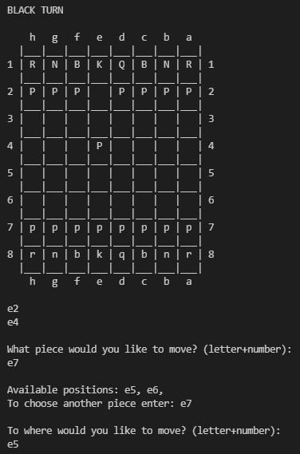

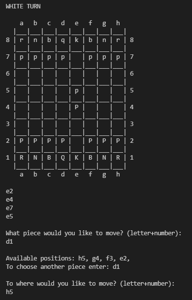

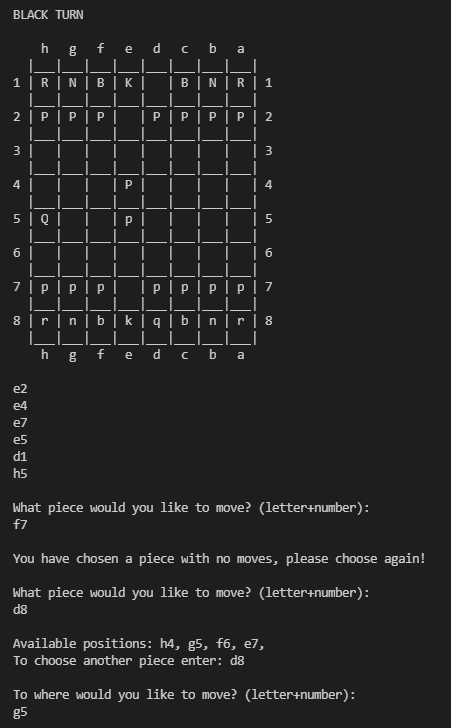

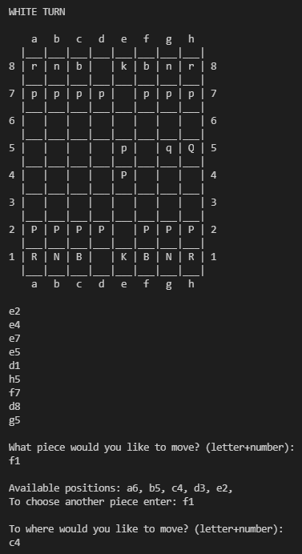

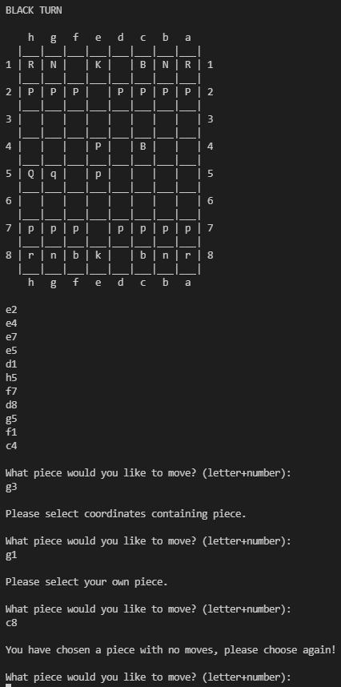

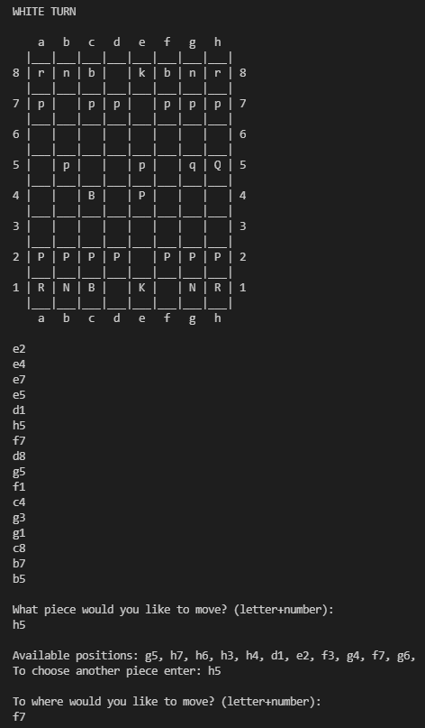

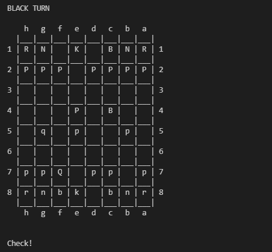

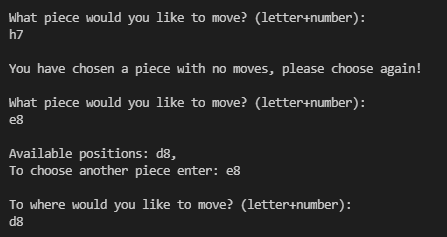

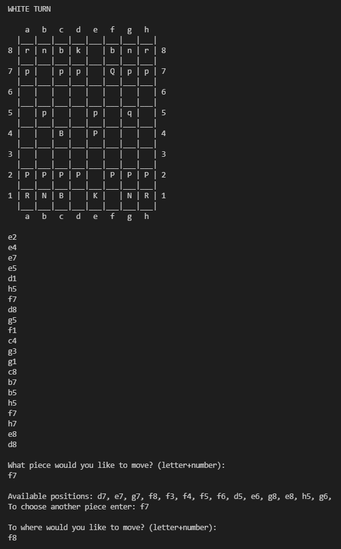

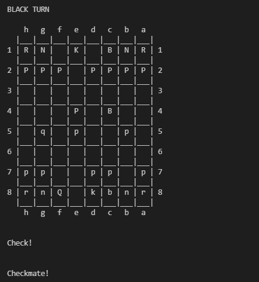

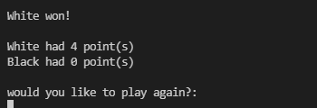
